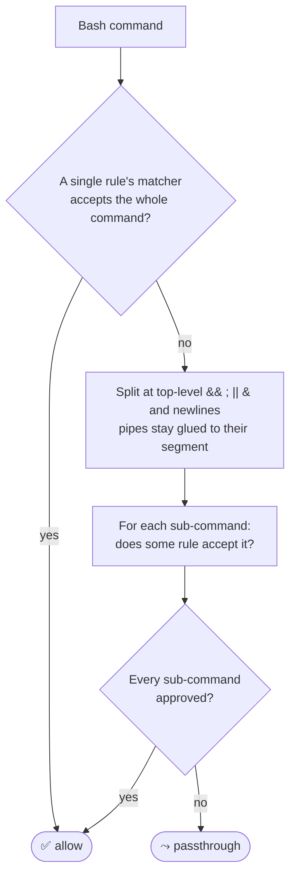

# anumati

**Stop approving the same Bash commands over and over.** anumati is a
`PreToolUse` hook for [Claude Code](https://code.claude.com) that auto-allows
_safe_ shell commands from a small config of **named matchers** — so `git
status`, `npx tsc`, `cargo test`, `jq`, and friends just run, while genuinely
risky commands still get a prompt.

When something falls through, anumati tells you the exact one-liner to allow it
next time — so your config **builds itself from real usage**.

```
$ git status && cargo test | tail -20
  ✓ auto-approved (no prompt)

$ terraform apply
  ⤳ prompt shown  ·  💡 anumati: no matcher covers "terraform"
```

## Why anumati

- **Deterministic, not vibes.** Approval is decided by explicit matchers with a
  strict grammar — not an LLM guessing whether a command is safe. The same
  command always gets the same answer.
- **Safe by construction.** Matchers allow only read-only / build / test shapes.
  Redirects that write files, `$(...)` substitution, network `curl` to unlisted
  domains, `git push`, `rm` — all fall through to a real prompt. anumati is
  **allow-only**: it can approve a call or step aside, but never blocks anything
  itself, and never widens what Claude Code would otherwise refuse.
- **Composes across a whole command line.** `git status && cargo build | tail`
  is approved only if _every_ piece is independently safe — you can't smuggle
  `rm -rf /` in by chaining it onto an allowed command.
- **Self-building config.** Every passthrough comes with a verified suggestion
  (`anumati add …`) and a logged reason, so you extend coverage from what you
  actually run.
- **Bash-only by design.** anumati vets `Bash` — the hard problem. `Read` /
  `Write` / `Edit` stay with Claude Code's own permission flow.

## How it works

Every time Claude Code is about to run a **Bash** command, the hook checks it
against your allow rules:

1. **A rule matches** → auto-approved, no prompt.
2. **No rule matches** → Claude Code shows its normal permission dialog, and
   anumati prints a 💡 suggestion for allowing it next time.

A command is approved one of two ways: a single matcher accepts the whole thing,
or — failing that — anumati splits it at top-level `&&`, `;`, `||`, `&`, and
newlines and approves only if **every** sub-command is independently accepted.



A disallowed sub-command always fails its own check, so chaining a bad command
onto a good one can't sneak it through. Pipes are never split across rules (a
pipe feeds data into the next command, so only the matcher owning the pipeline
can judge it). Configs cascade: a project config at
`<cwd>/.claude/permissions.json` is checked before your global
`~/.claude/permissions.json`.

The full model — matchers, composition rules, and safety guarantees — is in
[`docs/CONFIGURATION.md`](docs/CONFIGURATION.md).

## Install

```bash
npm install -g anumati
```

Or run without installing via `npx anumati ~/.claude/permissions.json`.

## Quick start

One command sets up everything:

```bash
anumati init
```

It prompts for **project** (this folder) or **root** (global) scope, then:

1. **Writes a starter config** of broadly-useful, low-risk rules — read-only
   inspection, git reads, `cd`/`sleep`/`echo`/`sed`/`jq`, `npx tsc`, `cargo`,
   `go`, test runners (`vitest`/`pytest`/`jest`), and pure-compute
   `python3`/`node`. Enough to be useful immediately.
2. **Scaffolds an audit log** next to the config.
3. **Registers the PreToolUse hook** in the sibling `settings.json` (merged
   non-destructively into any existing hooks).
4. **Adds a SessionStart banner** so you can see anumati is active.
5. **Writes command-style guidance** to the sibling `CLAUDE.md`, nudging the
   agent to emit approvable commands.

**Restart Claude Code (or run `/hooks`)** for it to take effect. Then just work
— routine commands stop prompting, and when something new falls through you'll
see a `💡 anumati add …` suggestion.

Grow your config as you go:

```bash
anumati add curl --domain api.github.com   # allow curl to a domain
anumati add git-write --git-ops add,commit  # allow specific git writes
anumati stats                               # see your auto-approve rate
anumati apply --all                         # apply accumulated suggestions
```

## Docs

- **[Configuration reference](docs/CONFIGURATION.md)** — every matcher, rule
  field, audit/sound/debug option, and CLI subcommand.
- **[Command-style guide](docs/COMMAND-STYLE.md)** — how to write commands that
  land on the auto-approve path (also installed into `CLAUDE.md` by `init`).

## License

MIT
